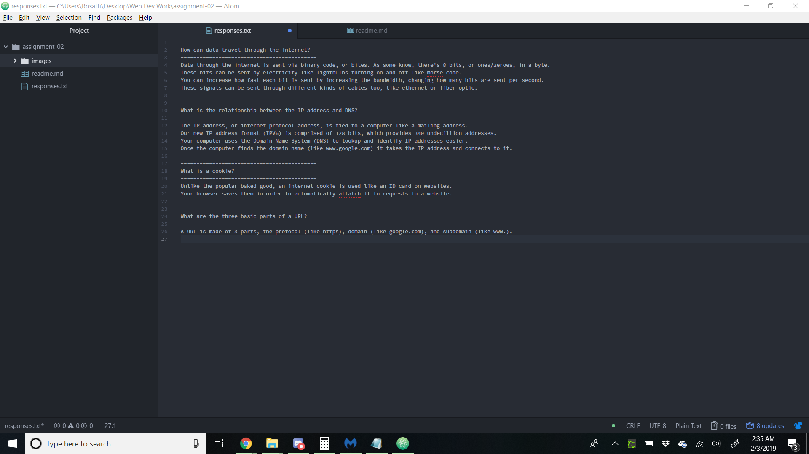

# Assignment 2
## Dominic Rosatti

Why did I take this class? Because despite how much I really do want to learn about web design, I'm taking this class because I need it for my major.
I know, I know. That's terrible. "How could you? This class is going to teach you a lot!" And it absolutely is. Don't take my real, honest answer as an insult.
I love all things digital, and that's why I'm here. I'm taking my major because, at some point, I'd like to be neck deep in the digital world.
YouTube ([you can find my channel here](https://www.youtube.com/channel/UCRrJn2vk3nmOfRc1onvA8Gw)), Twitch, possibly building games or websites myself. I know a lot, do a lot, and I'm great at a lot. So that's what I'm here for.
That power piece of paper, and another skill to add to my repitiore for a massively large price tag. I'm looking forward to a fun semester!

Things I've Learned/Want to Learn
1. That the original data sent over the internet was two letters.
2. I want to learn the best way to utilize vectors for web layout.
3. I want to brush up on my Markdown and Atom skills, like linking relative URLs to a [text file](./responses.txt), or an image/screenshot! !
