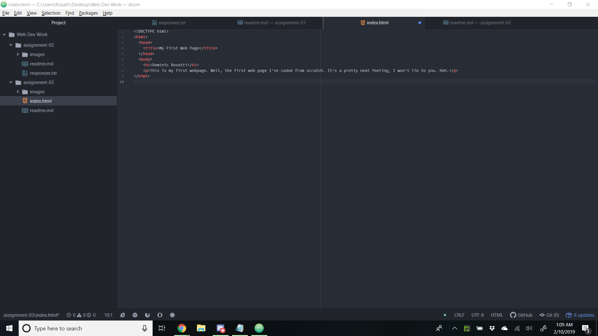

## How do web browsers function?

A web browser, like the popular Google Chrome web browser, is a tool that someone can use to access the web.
It basically takes everything that a web designer codes and translates it so you can read it the way they intend.
There are different browsers for those who like different user experiences.
The user interfaces allow us to interact with a web domain.
Tons of them can be customized with extensions that can do more with that code.
To summarize, web browsers are our way to interpret the language of the web.

## What is a markup language?

The markup language of a site or page is basically the architecture of a page.
The markup determines how a site is read and how it's built. Like any other language, each one is unique.
The most well known markup is HTML, which stands for Hypertext Markup Language.
Many other markup languages stem from HTML.

## Here's an image screenshot as a link.

