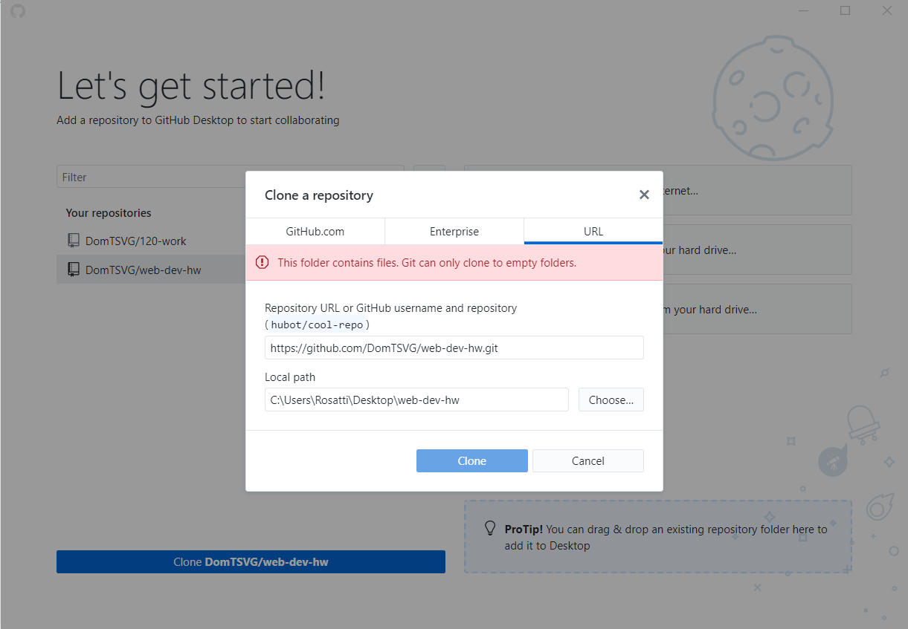

Using the Wayback Machine
-------------------------------------------
Using the fun tool of the Wayback Machine, I checked out Youtube.com. YouTube used to be much more simplified back in February of 2008. However, the interface was still as functional as ever. Since this time, the graphics and interface have been spiced up, yes, but some can say it's less user friendly. Hard to guage, but I still found both to be great websites.

How was the GIT module?
-------------------------------------------
My Github desktop was pretty messed up, in order to relog into my account I had to uninstall, then create an empty repo, and resign in. Yet it still ends up wonderful to work with and is very user friendly, just as I remember it from Creative Coding. Working with the GIT module has been a great refresher. It's not as difficult as I remember.

Screencap of working with the GIT module
-------------------------------------------

