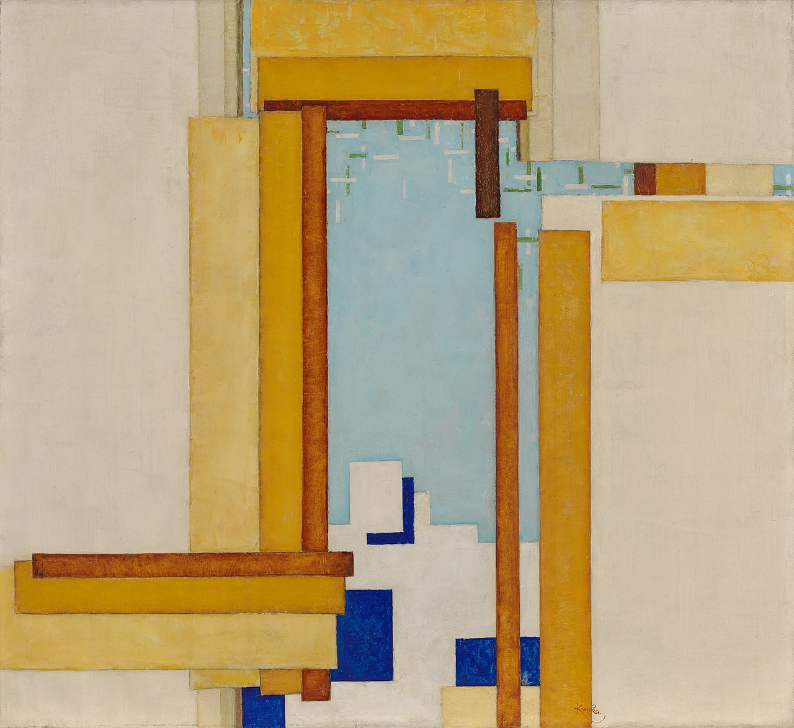

1. Padding is like an invisible border that seperates the border from the margins. The margins tell us how the text appears inside the element. The border simply outlines the element.
2. # Contrast Series (IV?)
By: František Kupka | 1935-1946

3. I started this project by choosing a picture, setting up my html, and the initial part of my stylesheet. I then started arranging all of my divs to make boxes to imitate the art, testing on multiple screen sizes. Lastly I polished up everything and added the original image off to the left.
